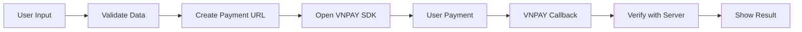

# 💳 VNPAY React Native Implementation

Tích hợp hoàn chỉnh VNPAY Mobile SDK cho React Native với Android & iOS support.

## 🚀 Quick Start

```bash
# 1. Clone hoặc copy các file implementation
# 2. Copy VNPAY SDK folder vào project
# 3. Setup dependencies
npm install

# 4. Run project
npx react-native run-android
npx react-native run-ios
```

## 📁 Files Created

| File | Mô tả | Loại |
|------|-------|------|
| `VNPayService.js` | Core service logic | **Essential** |
| `VNPayPaymentScreen.js` | Payment UI component | **Essential** |
| `Android_Configuration_Complete.md` | Android setup guide | Configuration |
| `iOS_Configuration_Complete.md` | iOS setup guide | Configuration |
| `VNPAY_Implementation_Complete_Guide.md` | Complete implementation guide | Documentation |

## ⚡ Key Features Implemented

### 🔧 Core Functionality
- ✅ VNPAY SDK integration
- ✅ Payment processing with multiple methods
- ✅ Deep link handling (Android & iOS)
- ✅ Server verification support
- ✅ Error handling & validation

### 🎨 UI/UX Features
- ✅ Modern payment interface
- ✅ Amount formatting (VND currency)
- ✅ Payment history display
- ✅ Loading states & feedback
- ✅ Multi-payment method selection

### 🛡️ Security & Best Practices
- ✅ Input validation
- ✅ Server-side verification
- ✅ Sandbox/Production modes
- ✅ Secure deep link handling
- ✅ Error logging & monitoring

## 🔧 Configuration Required

### 1. VNPAY Credentials
```javascript
const VNPAY_CONFIG = {
  scheme: 'your_app_scheme',        // Thay bằng scheme của bạn
  tmn_code: 'YOUR_TMN_CODE',        // Mã merchant từ VNPAY
  isSandBox: true,                  // false cho production
  api_base_url: 'your_server_url'   // URL server của bạn
};
```

### 2. Android Setup
- Update `android/build.gradle`
- Configure `AndroidManifest.xml`
- Add VNPAY package to `MainApplication.java`

### 3. iOS Setup
- Update `Info.plist` với URL schemes
- Configure `AppDelegate.m`
- Update `Podfile` và run `pod install`

## 📱 Usage Example

```javascript
import VNPayService from './src/services/VNPayService';

// Initialize VNPAY
VNPayService.initialize({
  scheme: 'your_scheme',
  tmn_code: 'YOUR_TMN_CODE',
  isSandBox: true,
  api_base_url: 'https://your-server.com/api'
});

// Make payment
const paymentData = {
  amount: 100000,
  orderInfo: 'Thanh toán đơn hàng',
  orderType: 'billpayment'
};

VNPayService.initiatePayment(paymentData, (result) => {
  if (result.success) {
    console.log('Payment successful!');
  } else {
    console.log('Payment failed:', result.message);
  }
});
```

## 🧪 Testing

### Deep Link Testing

**Android:**
```bash
adb shell am start -W -a android.intent.action.VIEW \
  -d "vnpaymerchant://payment-return?result=success" \
  com.yourapp.vnpay
```

**iOS:**
```bash
xcrun simctl openurl booted "vnpaymerchant://payment-return?result=success"
```

### Payment Flow Testing
1. Mở app và navigate đến payment screen
2. Nhập amount và order info
3. Chọn payment method
4. Tap "Thanh toán ngay"
5. Verify VNPAY SDK opens
6. Complete payment hoặc cancel
7. Verify callback handling

## 🔄 Payment Flow



## 🚨 Common Issues & Solutions

### Build Errors
- **Android**: Clean project và rebuild
- **iOS**: Delete `Pods/` folder và `pod install`

### Deep Link Issues
- **Check scheme** trong config files
- **Verify intent-filters** (Android)
- **Test với simulator** commands

### SDK Issues
- **Verify VNPAY SDK** đã copy đúng vị trí
- **Check dependencies** trong package.json
- **Update build configurations** theo guide

## 📊 Implementation Status

| Platform | Status | Notes |
|----------|--------|-------|
| Android | ✅ Complete | API Level 16+ |
| iOS | ✅ Complete | iOS 11.0+ |
| UI Components | ✅ Complete | Modern design |
| Deep Links | ✅ Complete | Both platforms |
| Error Handling | ✅ Complete | Comprehensive |
| Documentation | ✅ Complete | Step-by-step |

## 🎯 Next Steps

### For Development
1. **Customize UI** theo branding của app
2. **Implement server APIs** cho payment URL generation
3. **Add analytics** tracking
4. **Setup error monitoring** (Sentry, Crashlytics)

### For Production
1. **Update to production config**
2. **Implement server-side verification**
3. **Performance testing**
4. **Security audit**

## 📞 Support

### Implementation Files
- `VNPayService.js` - Core logic implementation
- `VNPayPaymentScreen.js` - UI component
- Configuration guides trong các file `.md`

### External Resources
- [VNPAY Documentation](https://vnpay.vn)
- [React Native Linking](https://reactnative.dev/docs/linking)
- [VNPAY GitHub](https://github.com/vnpay)

### Troubleshooting
Kiểm tra file `VNPAY_Implementation_Complete_Guide.md` để có troubleshooting chi tiết.

---

## ✨ Credits

Implementation này dựa trên:
- VNPAY Mobile SDK Documentation v1.1
- React Native best practices
- Modern UI/UX design patterns
- Security-first approach

**Happy Payment Processing! 💳🚀**